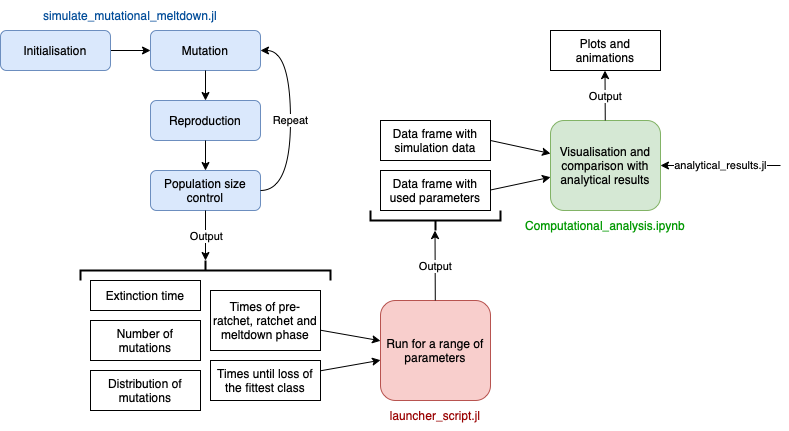

# Time-to-mutational-meltdown
Documentation of the simulation and the computational analysis of the manuscript \
**The extinction time under mutational meltdown** \
Lucy Lansch-Justen, Davide Cusseddu, Mark A. Schmitz, Claudia Bank \
bioRxiv 2022.02.01.478601; doi: [https://doi.org/10.1101/2022.02.01.478601](https://doi.org/10.1101/2022.02.01.478601).

The simulation of the population dynamics and mutation accumulation is done in the script `simulate_mutational_meltdown.jl`. First, the parameters are initialised and a founder population created, followed by repeated mutation, reproduction and population-size control steps. Possible outputs are the extinction time, the number or the distribution of mutations every generation, the beginning and ending of pre-ratchet, ratchet and meltdown phase and the times until the fittest class is lost.

We run the simulations for the parameter regime described in the manuscript using the script `launcher_script.jl`. Here, we are interested in the times of pre-ratchet, ratchet and meltdown phase and the times until loss of the fittest class. The outputs are a data frame with the simulation output and another data frame with the parameters used for this specific simulation. They can be identified via the seed from the random number generator.

The analysis is done in the jupyter notebook `Computational_analysis.ipynb`. This notebook is self-explanatory.




The simulations are done in the programming language [julia](https://julialang.org).
To replicate the data in the manuscript, clone this repository, install julia, start it and execute the following
```
include(".../launcher_script.jl")
ratchet_speeds_report()
times_phases_report()
```
with the dots replaced by the path to the repository.
This will run the simulations for the parameters used in the manuscript. Note that this will take some computational time. \
To start the notebook, execute
```
import Pkg
Pkg.add("IJulia")
using IJulia
notebook()
```
and navigate to the computational analysis notebook.
Within the notebook it is possible to simulate the population dynamics and mutation accumulation for a chosen set of parameters (feel free to play around with this) or analyse the data generated by the launcher script which are stored in the folder `data`. \
The raw plots of the manuscript can be found in the folder `plots`.
